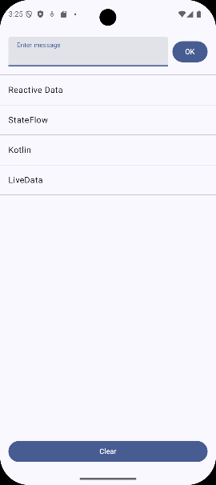

# reactive-data

```
AI-Assisted: This project was drafted with the assistance of artificial intelligence 
and reviewed by a human.
It was built by using small prompts so that the project could be kept simple, yet still 
for both Flow and LiveData to be demonstrated in a ViewModel / Repository architecture.
The final prompt asked for GOOD PRACTICE to be identified and commented in
```

This project could be built without the use of Viewmodels and Reactive Data Types, but the project has been set up
specifically to have 3 separate composables calling the ViewModel and having recomposition when the UiState changes. 

From the screenshot below - the top input field lets the ViewModel know that a String needs to be added to the underlying data
structure. The lazy list (middle section) will recompose when this structure changes. The bottom button will clear the data.



All branches compile and target to Android 16 (SDK 36)

### main branch
* kotlin + compose (StateFlow)
### livedata branch
* kotlin + compose (LiveData)